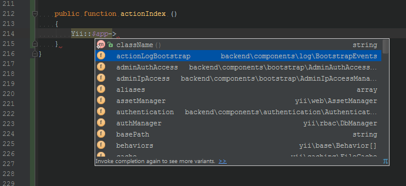

# Yii2 Autocomplete Helper

Хелпер генерации автодополнения IDE для пользовательских компонентов в фреймворке Yii2.

[![Latest Version on Packagist][ico-version]][link-packagist]
[![Software License][ico-license]](LICENSE.md)
[![Total Downloads][ico-downloads]][link-downloads]

Автодополнение в IDE для кастомных компонентов, добавленных в фреймворк вручную, не работает по умолчанию. Необходимо каждый раз помечать компоненты при работе самостоятельно.

Это расширение позволяет автоматически генерировать файл autocomplete.php c PHPDoc блоками, с помощью которого IDE будет распознавать компоненты.



## Установка

Используя Composer:

``` bash
$ composer require --dev "iiifx-production/yii2-autocomplete-helper:*"
```

Необходимо в секцию **scripts** файла **composer.json** добавить строку:

``` json
    "scripts": {
        "autocomplete": "autocomplete"
    }
```

## Использование

В любой момент в консоли выполнить:

``` bash
$ composer autocomplete
```

Хелпер сгенерирует файл autocomplete.php в корне проекта, который будет использоваться IDE.

> Чтобы IDE не ругался на два экземпляра класса Yii необходимо основной пометить как текстовый документ - [пример](mark-as-plain-text.png).

> В Advanced версии фреймворка перед использованием autocomplete необходимо развернуть окружение через "php init".

## Тесты

@TODO

## Лицензия

[![Software License][ico-license]](LICENSE.md)


[ico-version]: https://img.shields.io/packagist/v/iiifx-production/yii2-autocomplete-helper.svg
[ico-license]: https://img.shields.io/badge/license-MIT-brightgreen.svg
[ico-downloads]: https://img.shields.io/packagist/dt/iiifx-production/yii2-autocomplete-helper.svg
[ico-travis]: https://travis-ci.org/iiifx-production/yii2-autocomplete-helper.svg
[ico-scrutinizer]: https://scrutinizer-ci.com/g/iiifx-production/yii2-autocomplete-helper/badges/quality-score.png?b=master
[ico-codecoverage]: https://scrutinizer-ci.com/g/iiifx-production/yii2-autocomplete-helper/badges/coverage.png?b=master

[link-packagist]: https://packagist.org/packages/iiifx-production/yii2-autocomplete-helper
[link-downloads]: https://packagist.org/packages/iiifx-production/yii2-autocomplete-helper
[link-travis]: https://travis-ci.org/iiifx-production/yii2-autocomplete-helper
[link-scrutinizer]: https://scrutinizer-ci.com/g/iiifx-production/yii2-autocomplete-helper/?branch=master
